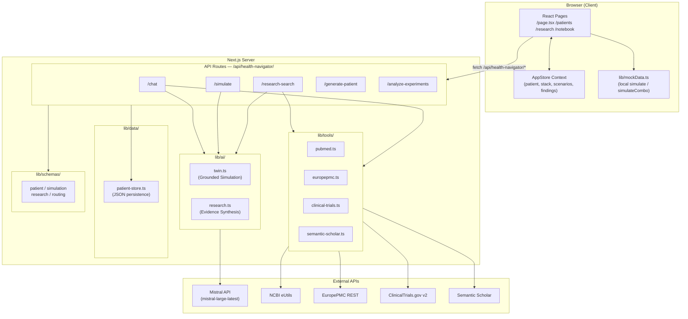
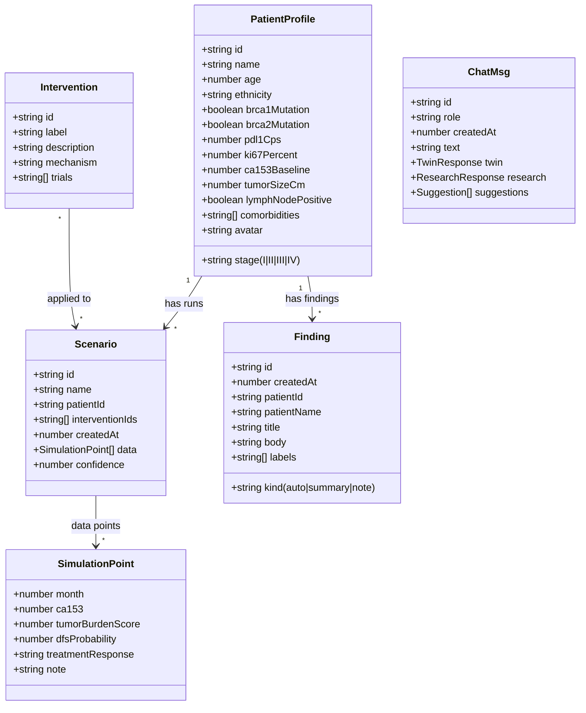
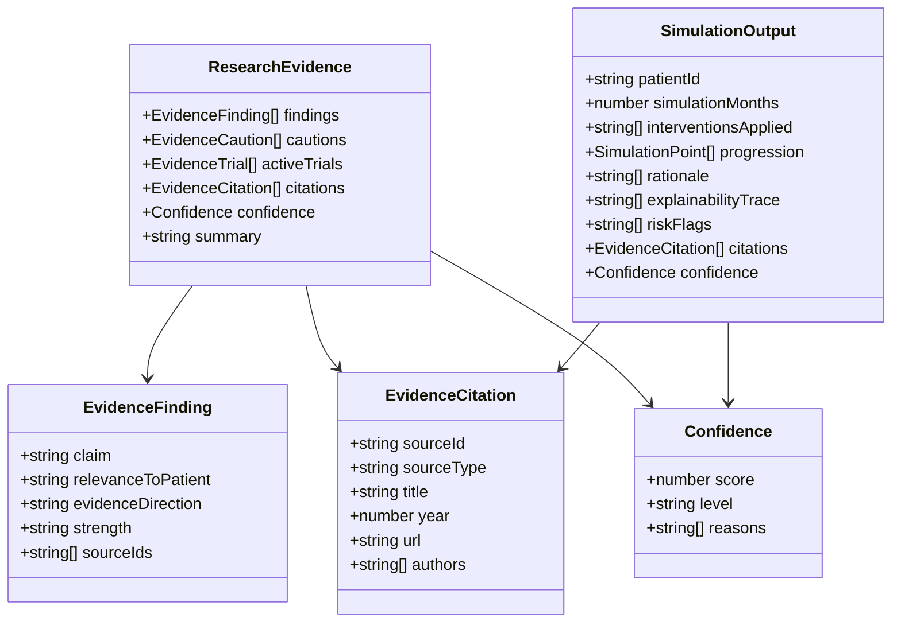
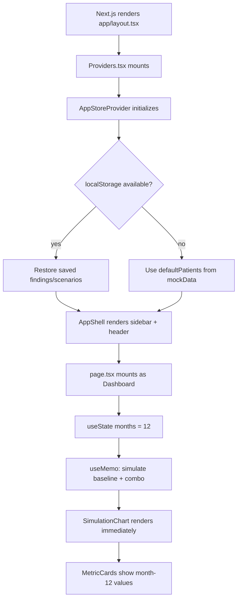
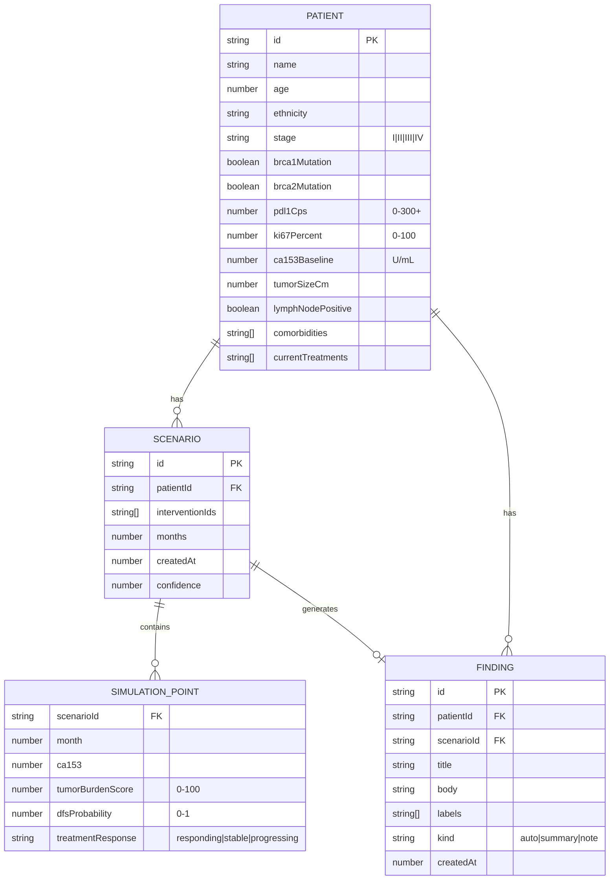
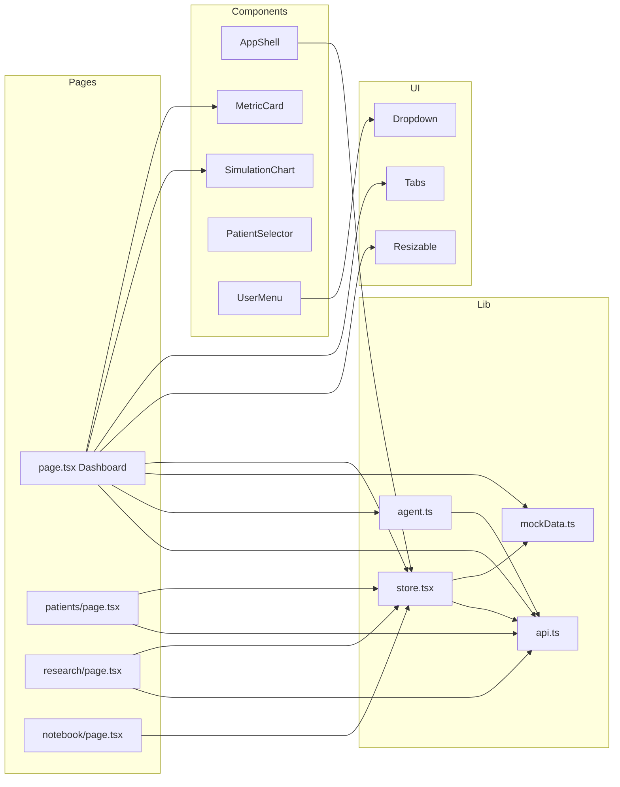

# 📘 DEVELOPER.md — Helix TNBC Digital Twin

> Developer guide for the Helix platform: an AI-powered digital twin for Triple-Negative Breast Cancer (TNBC) simulation, evidence-grounded treatment planning, and clinical research synthesis.

---

## 1. Overview

**Helix** is a clinical decision-support tool that lets oncologists interact with a digital twin of a TNBC patient. Clinicians can stack treatment interventions (pembrolizumab, PARP inhibitors, sacituzumab, etc.), simulate 6–24 month biomarker trajectories, retrieve grounded research evidence from PubMed, EuropePMC, ClinicalTrials.gov, and Semantic Scholar, and maintain a notebook of findings across simulation runs.

### Key Use Cases
- **What-if simulation**: "What happens to CA 15-3 if we add pembrolizumab + chemo for 12 months?"
- **Evidence retrieval**: "Fetch KEYNOTE-522 trial data and synthesize findings for this patient."
- **Patient comparison**: "Generate a synthetic Stage III TNBC patient with BRCA1 mutation."
- **Cross-experiment analysis**: "Compare my last 3 simulation runs for Aaliyah Washington."
- **Notebook**: Persist auto-extracted findings and manual clinician notes per patient.

### What It Is Not
This is a research and decision-support tool, not a clinical-grade diagnostic system. All simulation outputs are grounded in published trial data but are not validated for real-world clinical use.

---

## 2. Tech Stack

| Layer | Technology |
|-------|-----------|
| **Framework** | Next.js 16.2.4 (App Router) |
| **Language** | TypeScript 5, React 19 |
| **Styling** | Tailwind CSS v4 (OKLch color space), tw-animate-css |
| **UI Primitives** | Radix UI (Tabs, Dropdown Menu, Separator, Slot) |
| **Charts** | Recharts 2 |
| **Panels** | react-resizable-panels 4 |
| **Icons** | lucide-react |
| **AI / LLM** | Vercel AI SDK 6, Mistral (`mistral-large-latest`), optional Groq (llama-3.3-70b) |
| **Schema Validation** | Zod v4 |
| **Class Merging** | clsx + tailwind-merge |
| **Research APIs** | PubMed (NCBI eUtils), EuropePMC REST, ClinicalTrials.gov v2, Semantic Scholar Graph API |
| **State Management** | React Context (client-only, no external store) |
| **Persistence** | JSON file (`data/experiment-store.json`) for server-side experiments |
| **Runtime** | Node.js (Next.js server) |

---

## 3. Architecture Overview

Helix is a **unified full-stack Next.js application**. The React frontend and the AI API layer live in the same project — no CORS, no separate service. The architecture is layered:

1. **UI Layer** — React client components (pages + `AppShell`)
2. **State Layer** — `AppStore` React Context (client-side simulation state, findings, scenarios)
3. **API Layer** — Next.js Route Handlers under `app/api/health-navigator/`
4. **AI Orchestration Layer** — `lib/ai/` (Mistral calls for simulation + research synthesis)
5. **Research Tools Layer** — `lib/tools/` (PubMed, EuropePMC, ClinicalTrials, Semantic Scholar)
6. **Schema Layer** — `lib/schemas/` (Zod validation for all inputs and LLM outputs)
7. **Data Layer** — `lib/data/` (JSON file-based patient + experiment persistence)



### Design Decisions
- **Single origin** — frontend and API share the same Next.js process, so all fetch calls use relative paths (`/api/health-navigator/...`). No `VITE_API_URL` or CORS config needed.
- **Local fallback** — `lib/agent.ts` contains a full local response builder. If the API is unreachable, the UI degrades gracefully using `mockData.ts` simulation math.
- **Optimistic UI** — simulation trajectories render immediately from `mockData.ts`. The `runScenario()` store method calls `/api/health-navigator/simulate` in the background.

---

## 4. Folder Structure

```
tuff-twin/
├── DEVELOPER.md              ← this file
├── LICENSE
├── README.md
└── api/                      ← unified Next.js project (EVERYTHING lives here)
    ├── .env.local             ← API keys (never commit)
    ├── next.config.ts         ← minimal Next.js config
    ├── tsconfig.json          ← TypeScript config, @/* path alias
    ├── package.json           ← dependencies + scripts
    ├── postcss.config.mjs     ← Tailwind v4 postcss plugin
    │
    ├── app/                   ← Next.js App Router
    │   ├── layout.tsx         ← Root layout: fonts + <Providers> wrapper
    │   ├── globals.css        ← Tailwind + full OKLch design system
    │   ├── page.tsx           ← Dashboard (chat + simulation workspace)
    │   ├── patients/
    │   │   └── page.tsx       ← Patient cohort management
    │   ├── research/
    │   │   └── page.tsx       ← Standalone research agent chat
    │   ├── notebook/
    │   │   └── page.tsx       ← Findings notebook + clinician notes
    │   └── api/
    │       ├── health-navigator/
    │       │   ├── chat/route.ts               ← Twin agent chat endpoint
    │       │   ├── simulate/route.ts            ← Grounded simulation endpoint
    │       │   ├── research-search/route.ts     ← Literature search + synthesis
    │       │   ├── generate-patient/route.ts    ← Synthetic patient generation
    │       │   └── analyze-experiments/route.ts ← Cross-experiment analysis
    │       ├── patients/
    │       │   └── [patientId]/
    │       │       ├── route.ts                 ← GET patient by ID
    │       │       └── experiments/route.ts     ← GET/POST experiments
    │       └── session/[id]/route.ts            ← In-memory session store
    │
    ├── components/            ← Shared React components
    │   ├── Providers.tsx       ← AppStoreProvider + AppShell wrapper (client)
    │   ├── AppShell.tsx        ← Sidebar nav, header, layout shell
    │   ├── UserMenu.tsx        ← Clinician menu, dark mode toggle
    │   ├── PatientSelector.tsx ← Patient picker with biomarker preview
    │   ├── MetricCard.tsx      ← CA 15-3 / Tumor Burden / DFS metric display
    │   ├── SimulationChart.tsx ← Recharts line chart for trajectories
    │   └── ui/
    │       ├── dropdown-menu.tsx ← Radix DropdownMenu wrapper
    │       ├── tabs.tsx          ← Radix Tabs wrapper
    │       ├── resizable.tsx     ← react-resizable-panels wrapper
    │       └── utils.ts          ← cn() classname merger
    │
    ├── lib/                   ← Business logic + utilities
    │   ├── mockData.ts         ← Patient profiles, interventions, simulation math
    │   ├── store.tsx           ← React Context: AppStore (client state)
    │   ├── agent.ts            ← Chat message building, intervention parsing
    │   ├── api.ts              ← Typed fetch wrappers for all API routes
    │   ├── utils.ts            ← cn() Tailwind merge utility
    │   ├── ai/
    │   │   ├── twin.ts         ← Mistral-grounded simulation orchestration
    │   │   └── research.ts     ← Multi-source evidence synthesis orchestration
    │   ├── schemas/
    │   │   ├── patient.ts      ← Zod: PatientProfileSchema
    │   │   ├── simulation.ts   ← Zod: SimulationPoint, SimulationOutput
    │   │   ├── research.ts     ← Zod: ResearchEvidence, ResearchInputs
    │   │   ├── research-evidence.ts ← Zod: EvidenceFinding, Citation, Trial
    │   │   └── routing.ts      ← Zod: RoutingDecision (intent classification)
    │   ├── tools/
    │   │   ├── pubmed.ts       ← NCBI eUtils: searchPubMed()
    │   │   ├── europepmc.ts    ← EBI REST: searchEuropePMC()
    │   │   ├── clinical-trials.ts ← ClinicalTrials.gov v2: searchClinicalTrials()
    │   │   └── semantic-scholar.ts ← S2 Graph API: searchSemanticScholar()
    │   ├── data/
    │   │   ├── patient-store.ts ← File-based patient + experiment persistence
    │   │   └── experiment-store.json ← JSON datastore (gitignored in prod)
    │   └── memory/
    │       └── session-store.ts ← In-memory per-request session state
    │
    ├── data/
    │   ├── demo-patients.ts    ← 3 hardcoded demo TNBC patients
    │   ├── synthea-patients.ts ← Synthea-generated patient cohort
    │   └── synthetic_patients/ ← (empty placeholder)
    │
    └── supervisor/             ← Optional Node.js supervisor process
```

---

## 5. Core Components

### 5.1 `lib/mockData.ts` — Simulation Engine (Client-side)

The in-browser simulation engine. No server call required.

**Purpose**: Provides deterministic, patient-specific TNBC biomarker trajectory math based on published intervention effect sizes.

**Key exports**:
```typescript
PatientProfile        // Full TNBC patient: BRCA status, PD-L1, Ki-67, CA 15-3, etc.
Intervention          // Treatment: {id, label, description, mechanism, trials[]}
SimulationPoint       // Month snapshot: {month, ca153, tumorBurdenScore, dfsProbability, treatmentResponse}

simulate(patient, "baseline", months)        // Returns SimulationPoint[] with no treatment
simulateCombo(patient, interventionIds[], months) // Returns SimulationPoint[] with stacked effects
```

**Intervention effect model**: Each intervention has delta coefficients for CA 15-3, tumor burden, and DFS. The combo model applies all effects multiplicatively with a 10% synergy bonus per additional agent.

**Hardcoded patients**: Aaliyah Washington (Stage III, BRCA1+), Sarah Kim (Stage II), Emily Hartwell (Stage IV, BRCA2+).

---

### 5.2 `lib/store.tsx` — Client State (React Context)

**Purpose**: Single source of truth for all interactive UI state. Implemented as a React Context to avoid prop drilling across the deep component tree.

**Key state**:
```typescript
patient: PatientProfile         // Active patient
patients: PatientProfile[]      // Full cohort
stack: string[]                 // Active intervention IDs
months: 6 | 12 | 18 | 24       // Simulation duration
activeMetric: MetricKey         // Which chart is focused
scenarios: Scenario[]           // Saved simulation runs
findings: Finding[]             // Notebook entries
```

**Key methods**:
```typescript
setPatient(p)                    // Switch active patient
toggleStack(id)                  // Add/remove intervention from stack
runScenario(stack)               // Calls /api/health-navigator/simulate, stores result
addFinding({title, body, ...})   // Add to notebook
generateSummary()                // Calls /api/health-navigator/analyze-experiments
```

**Usage**: Any `"use client"` component calls `const { patient, stack } = useAppStore()`.

---

### 5.3 `lib/agent.ts` — Chat Response Builder

**Purpose**: Bridges the chat UI to backend responses, with a full local fallback.

```typescript
parseInterventions(text: string): string[]
// Scans user text for intervention keywords → returns IDs

buildAssistantResponse(patient, stack, text, months): Promise<AssistantResponse>
// 1. Calls /api/health-navigator/chat
// 2. Falls back to buildLocalResponse() on error

whyChanged(metric, baseline, comparison, stack): WhyResult
// Returns {biological: string, evidence: string[]} explaining metric shift
```

**Chat message type**:
```typescript
type ChatMsg = {
  id: string; role: "user" | "assistant"; createdAt: number;
  text?: string;                           // user messages
  twin?: TwinResponse;                     // AI simulation summary
  research?: ResearchResponse;             // Literature evidence
  suggestions?: {id, label, reason}[];     // Intervention suggestions
}
```

---

### 5.4 `lib/ai/twin.ts` — Grounded Twin Simulation

**Purpose**: Uses Mistral to produce clinically-grounded simulation output validated against published TNBC trial data.

**Flow**:
1. Receives patient profile + intervention scenario + pre-fetched research evidence
2. Constructs a system prompt embedding TNBC clinical context + uncertainty requirements
3. Calls Mistral `generateObject()` with `RawSimulationOutputSchema` as the output schema
4. Post-processes: adds explainabilityTrace, riskFlags, and computes confidence score
5. Risk flags include: BRCA status, lymph node involvement, Ki-67 > 60%, CA 15-3 > 35

**Confidence scoring**:
```
base = evidence.confidence * 0.85
+10 if rationale count ≥ 3
+5  if citations present
-20 if reasoning contains uncertainty keywords
= clamp(0, 100)
```

---

### 5.5 `lib/ai/research.ts` — Evidence Synthesis

**Purpose**: Orchestrates multi-source literature retrieval and synthesizes a structured evidence base using Mistral.

**Flow**:
1. Receives pre-fetched papers from PubMed, EuropePMC, SemanticScholar, and trials from ClinicalTrials
2. Calls Mistral `generateObject()` with `RawResearchEvidenceSchema`
3. Deduplicates citations across sources
4. Computes confidence score based on source diversity + finding quality
5. Falls back to raw citation list if synthesis fails
6. Makes a second Mistral call to generate a 2-3 sentence human-readable summary

**Confidence scoring**:
```
base: 25
+20 if PubMed results present
+8  if EuropePMC results present
+6  if Semantic Scholar present
+5  per clinical trial
+count of findings (capped at 15)
+10/5/2 for high/moderate/low strength findings
-15 if any finding has "uncertain" direction
```

---

### 5.6 `lib/tools/` — Research Data Sources

Four independent fetch modules, each with its own fallback query strategy:

| Module | Source | Auth | Caching |
|--------|--------|------|---------|
| `pubmed.ts` | NCBI eUtils (XML) | `NCBI_API_KEY` (optional) | None |
| `europepmc.ts` | EBI REST (JSON) | None | `revalidate: 3600` (1h) |
| `clinical-trials.ts` | ClinicalTrials.gov v2 | None | None |
| `semantic-scholar.ts` | S2 Graph API | `SEMANTIC_SCHOLAR_API_KEY` (optional) | None |

All modules return typed arrays and fail silently (return `[]`) on network errors.

---

### 5.7 `lib/schemas/` — Zod Validation Layer

Every API input and LLM output is validated with Zod:

| Schema File | Key Schemas |
|------------|------------|
| `patient.ts` | `PatientProfileSchema` — full TNBC patient with clinical constraints |
| `simulation.ts` | `SimulationPointSchema`, `SimulationOutputSchema` with confidence |
| `research-evidence.ts` | `EvidenceFindingSchema`, `EvidenceCitationSchema`, `ResearchEvidenceSchema` |
| `research.ts` | `ResearchInputs`, `ResearchOutput`, `RawResearchEvidenceSchema` |
| `routing.ts` | `RoutingDecisionSchema` — intent classification for chat messages |

Using `generateObject()` from the Vercel AI SDK with a Zod schema forces Mistral to produce structured, type-safe output.

---

### 5.8 `components/AppShell.tsx` — Layout

**Purpose**: Persistent sidebar navigation and top header shared across all pages.

- Reads `pathname` from `usePathname()` (Next.js) for active nav highlighting
- Reads `findings.length` from `useAppStore()` to show notebook badge
- Shows active patient card in sidebar footer
- Mobile: horizontal nav strip below header
- Desktop: 230px fixed sidebar

---

## 6. Class / Type Diagrams

### Core Domain Types



### AI Layer Types



---

## 7. Key Flows

### 7.1 Chat Message Flow (Twin Agent)

```mermaid
sequenceDiagram
    participant User
    participant Dashboard (page.tsx)
    participant agent.ts
    participant /api/health-navigator/chat
    participant PubMed / EuropePMC
    participant Mistral

    User->>Dashboard: Types message + presses Send
    Dashboard->>agent.ts: buildAssistantResponse(patient, stack, text, months)
    agent.ts->>Dashboard: setThinking("twin")

    agent.ts->>/api/health-navigator/chat: POST {patient, stack, userText}
    /api/health-navigator/chat->>PubMed / EuropePMC: searchPubMed() + searchEuropePMC()
    PubMed / EuropePMC-->>/api/health-navigator/chat: papers[]

    /api/health-navigator/chat->>Mistral: generateObject(ChatResponseSchema)
    Note over Mistral: Prompt includes TNBC context,\nevidence, uncertainty rules
    Mistral-->>/api/health-navigator/chat: {twin, research, suggestions}

    /api/health-navigator/chat-->>agent.ts: ChatApiResponse
    agent.ts->>Dashboard: setThinking("research")
    agent.ts->>Dashboard: append assistant message (twin + research)
    Dashboard->>Dashboard: setThinking(null) — render complete
```

### 7.2 Simulation Flow (Grounded Twin)

```mermaid
sequenceDiagram
    participant Store (store.tsx)
    participant /api/health-navigator/simulate
    participant Tools (pubmed/epmc/ct/s2)
    participant research.ts
    participant twin.ts
    participant Mistral

    Store->>/ api/health-navigator/simulate: POST {patient, interventionIds, months}

    par Parallel research retrieval
        /api/health-navigator/simulate->>Tools: searchPubMed(query)
        /api/health-navigator/simulate->>Tools: searchEuropePMC(query)
        /api/health-navigator/simulate->>Tools: searchClinicalTrials(condition)
        /api/health-navigator/simulate->>Tools: searchSemanticScholar(query)
    end

    Tools-->>/api/health-navigator/simulate: papers[], trials[]

    /api/health-navigator/simulate->>research.ts: runResearchSynthesis({profile, papers, trials})
    research.ts->>Mistral: generateObject(RawResearchEvidenceSchema)
    Mistral-->>research.ts: structured evidence
    research.ts->>Mistral: buildSummary (2nd call)
    Mistral-->>research.ts: summary string
    research.ts-->>/api/health-navigator/simulate: ResearchEvidence

    /api/health-navigator/simulate->>twin.ts: runGroundedTwinSimulation({profile, scenario, evidence, months})
    twin.ts->>Mistral: generateObject(RawSimulationOutputSchema)
    Mistral-->>twin.ts: progression[], rationale[]
    twin.ts-->>/api/health-navigator/simulate: SimulationOutput

    /api/health-navigator/simulate-->>Store: {simulation, research}
    Store->>Store: addScenario() + addFinding()
```

### 7.3 Research Search Flow

```mermaid
sequenceDiagram
    participant ResearchPage (research/page.tsx)
    participant /api/health-navigator/research-search
    participant PubMed
    participant EuropePMC
    participant ClinicalTrials
    participant Mistral

    ResearchPage->>/api/health-navigator/research-search: POST {query, patient}

    par Parallel search
        /api/health-navigator/research-search->>PubMed: searchPubMed(query)
        /api/health-navigator/research-search->>EuropePMC: searchEuropePMC(query)
        /api/health-navigator/research-search->>ClinicalTrials: searchClinicalTrials(query)
    end

    /api/health-navigator/research-search->>Mistral: synthesis prompt
    Mistral-->>/api/health-navigator/research-search: synthesis, keyInsight

    /api/health-navigator/research-search-->>ResearchPage: {papers[], trials[], synthesis, summary}
```

### 7.4 Page Load / State Initialization



---

## 8. Data Model / Schema

### Patient Biomarker Profile



### Key Biomarker Reference Ranges

| Biomarker | Normal | Elevated (Concern) |
|-----------|--------|--------------------|
| CA 15-3 | < 31 U/mL | > 35 U/mL triggers risk flag |
| Ki-67 | < 20% | > 60% triggers risk flag |
| PD-L1 CPS | — | ≥ 10 → pembrolizumab eligible |
| Tumor Burden Score | 0 (none) | 100 (maximum burden) |
| DFS Probability | 1.0 (100%) | 0.0 (0%) |

---

## 9. Configuration & Environment

### Environment Variables (`.env.local`)

| Variable | Required | Description |
|----------|----------|-------------|
| `MISTRAL_API_KEY` | **Yes** | Primary LLM for simulation + synthesis |
| `NCBI_API_KEY` | No | PubMed rate limit upgrade (10 req/s vs 3) |
| `SEMANTIC_SCHOLAR_API_KEY` | No | Semantic Scholar API key for faster access |
| `GROQ_API_KEY` | No | Optional Groq fallback LLM |
| `GROQ_MODEL` | No | Groq model ID (default: llama-3.3-70b-versatile) |
| `ANTHROPIC_API_KEY` | No | Anthropic SDK installed but not actively used |
| `JWT_SECRET_KEY` | No | For future session auth |
| `NEXT_BACKEND_URL` | No | Self-reference URL (unused in unified app) |
| `SUPERVISOR_PORT` | No | Optional supervisor process port (8000) |

### Path Aliases

All imports use the `@/` alias which maps to the project root (`api/`):
```typescript
import { useAppStore } from "@/lib/store";      // api/lib/store.tsx
import { MetricCard } from "@/components/MetricCard"; // api/components/MetricCard.tsx
```

### Tailwind Theme

The design system lives in `app/globals.css` as CSS custom properties. Key tokens:

```css
--primary: oklch(0.55 0.20 355)          /* Rose pink — breast cancer awareness */
--chart-intervention: oklch(0.55 0.20 355)
--chart-baseline: oklch(0.65 0.08 250)   /* Muted blue for comparison line */
--gradient-primary: 135deg rose blend
```

Dark mode is toggled by adding `.dark` to `<html>` (see `UserMenu.tsx` → `useDarkMode()`). Persisted to `localStorage["helix-theme"]`.

---

## 10. Build & Run Instructions

### Prerequisites
- Node.js 18+
- npm 9+
- A valid `MISTRAL_API_KEY` (minimum to use AI features)

### Setup

```bash
# 1. Navigate to the app directory
cd api/

# 2. Install dependencies
npm install

# 3. Copy environment template
cp .env.local.example .env.local   # then fill in MISTRAL_API_KEY at minimum

# 4. Start development server
npm run dev
# → http://localhost:3000
```

### Production Build

```bash
cd api/
npm run build    # Next.js static + server build
npm run start    # Start production server on port 3000
```

### Without AI Keys

The app is fully usable without API keys:
- Simulation runs locally using `mockData.ts` math (instant, no API call)
- Chat still works via the local `buildLocalResponse()` fallback in `agent.ts`
- Only research-search and generate-patient features require `MISTRAL_API_KEY`

---

## 11. Testing Strategy

### Current State

There are no automated test files in the project yet. The `app/api/` directory contains several **manual test routes** that can be exercised via HTTP:

| Test Route | Purpose |
|-----------|---------|
| `GET /api/simulate-test` | Runs a hardcoded simulation and returns JSON output |
| `GET /api/simulate-grounded-test` | Tests the full grounded twin pipeline |
| `GET /api/research-test` | Tests raw literature search |
| `GET /api/research-synthesize-test` | Tests the full synthesis pipeline |

These are development debugging endpoints, not automated tests.

### Recommended Test Strategy (To Implement)

```
tests/
├── unit/
│   ├── mockData.test.ts         # simulate() and simulateCombo() math
│   ├── agent.test.ts            # parseInterventions(), computeDeltas()
│   └── schemas.test.ts          # Zod schema validation edge cases
├── integration/
│   ├── chat-route.test.ts       # POST /api/health-navigator/chat
│   ├── simulate-route.test.ts   # POST /api/health-navigator/simulate
│   └── research-route.test.ts   # POST /api/health-navigator/research-search
└── e2e/
    ├── dashboard.spec.ts         # Playwright: intervention stack + chart
    ├── research.spec.ts          # Playwright: research chat flow
    └── notebook.spec.ts          # Playwright: note creation + filtering
```

**Recommended frameworks**: Vitest (unit/integration), Playwright (e2e).

---

## 12. Extensibility & Best Practices

### Adding a New Intervention

1. Add to `interventions` array in `lib/mockData.ts`:
```typescript
{
  id: "new_drug",
  label: "New Drug Label",
  description: "...",
  mechanism: "...",
  trials: ["TRIAL-ID"],
}
```

2. Add effect coefficients to `INTERVENTION_EFFECTS` in the same file:
```typescript
new_drug: { ca153: -0.15, tumorBurden: -0.20, dfs: 0.12 }
```

3. The intervention automatically appears in the chat UI toggle chips on the Dashboard.

### Adding a New Research Tool

1. Create `lib/tools/new-source.ts` following the existing pattern:
```typescript
export type NewSourceArticle = { id: string; title: string; url?: string; ... }
export async function searchNewSource(query: string, limit = 10): Promise<NewSourceArticle[]>
```

2. Call it in `app/api/health-navigator/research-search/route.ts` in the parallel fetch block.
3. Pass results into `runResearchSynthesis()` in `lib/ai/research.ts`.
4. Update `computeResearchConfidence()` to account for the new source type.

### Adding a New Page/Route

1. Create `app/new-page/page.tsx` with `"use client"` at the top.
2. Export `default function NewPage()`.
3. Add to the `NAV` array in `components/AppShell.tsx`:
```typescript
{ to: "/new-page", label: "New Page", icon: SomeIcon }
```

### Adding a New API Endpoint

1. Create `app/api/health-navigator/new-endpoint/route.ts`.
2. Export `async function POST(req: Request)`.
3. Validate input with a Zod schema from `lib/schemas/`.
4. Add a typed fetch wrapper to `lib/api.ts`.

### Code Conventions

| Convention | Pattern |
|-----------|---------|
| All interactive components | Must have `"use client"` directive |
| Server components | No `useState`, no browser APIs — default in `app/` |
| Zod schemas | Define in `lib/schemas/`, import everywhere |
| CSS classes | Use `cn()` from `@/lib/utils` for conditional Tailwind |
| Relative API paths | All fetch calls use `/api/...` (never `http://localhost:...`) |
| AI calls | Always use `generateObject()` with a Zod schema for type safety |
| Error handling | API routes return `{ok: false, error: string}` with appropriate HTTP status |

---

## 13. Known Limitations & TODOs

### Current Limitations

| Area | Issue |
|------|-------|
| **Persistence** | `data/experiment-store.json` is a flat JSON file — no database. Not suitable for multi-user or production use. |
| **Authentication** | No real auth. `JWT_SECRET_KEY` is configured but the session system is not wired to route protection. |
| **Patient state** | All patient state lives in React Context (in-memory). Refreshing the page loses scenarios and findings unless localStorage is also used. |
| **Research caching** | PubMed results are not cached. Repeated queries for the same topic re-fetch from NCBI on every request. |
| **Simulation accuracy** | The local `mockData.ts` simulation uses simplified linear math. The grounded Mistral simulation is better, but neither is clinically validated. |
| **Test coverage** | No automated tests exist. The test routes are manual HTTP endpoints only. |
| **Mobile layout** | The resizable panel layout (`ResizablePanelGroup`) is not usable on mobile screens. The mobile nav shows links but the Dashboard is desktop-only. |
| **Error states** | Many API failures surface as empty states rather than user-visible error messages. |

### Technical Debt

| Item | Location | Notes |
|------|---------|-------|
| Pre-existing TypeScript errors | `app/api/simulate-*-test/` and `lib/memory/session-store.ts` | `semanticScholar` missing from `ResearchInputs` type, `ResearchOutput` export missing. Not in the main app flow. |
| `supervisor/` folder | `api/supervisor/` | Contains an Express/Node.js supervisor process. Not integrated into the main Next.js app. Unclear purpose. |
| `NEXT_BACKEND_URL` env var | `.env.local` | Left over from when frontend and backend were separate processes. Not needed in unified app. |
| Duplicate `cn()` utility | `components/ui/utils.ts` and `lib/utils.ts` | Both export the same function. Should consolidate to one. |
| Groq SDK installed | `package.json` | `GROQ_API_KEY` configured but no Groq calls in active code paths. |

### Roadmap / TODOs

- [ ] Replace JSON file store with a real database (SQLite via Prisma, or Postgres)
- [ ] Add authentication (NextAuth.js or Clerk)
- [ ] Add localStorage persistence for client-side scenarios + findings
- [ ] Cache PubMed / EuropePMC results (Redis or Next.js `unstable_cache`)
- [ ] Write Vitest unit tests for `mockData.ts` simulation math
- [ ] Write Playwright e2e tests for the Dashboard flow
- [ ] Add proper error boundaries and user-visible error toasts
- [ ] Mobile-responsive layout for the Dashboard (collapsible panels)
- [ ] Streaming responses for the twin chat (use `streamObject()` instead of `generateObject()`)
- [ ] Add support for additional AI models (switch between Mistral / GPT-4o / Claude based on task)

---

## Appendix: Mermaid — Component Dependency Map


